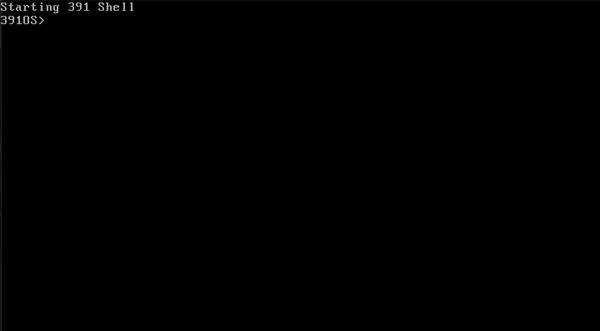

# FuzzyOS

A fully functional Linux based operating system with support for scheduled context-switching, segmented memory protection, a read-only file system, paging, interrupts and exceptions, drivers for keyboard inputs, multiple terminal outputs, and RTC virtualization. 

Built as a final project for [ECE 391 at UIUC](https://ece.illinois.edu/academics/courses/ece391)

## Academic Integrity Violation

Please refer your student code and the academic-integrity.md file for academic integrity requirements. You may use code from this project freely under the license terms, but it is **your own responsibility** to ensure that such use meets the requirements set by your course and department. I am not responsible for any academic integrity violations for use of other students copying any portion of this code.

## Getting Started

These instructions will get you a copy of the project up and running on your local machine for development and testing purposes. 

### Prerequisites

You must have the QEMU emulator already installed 

```
qemu-system-i386 -hda "student-distrib/mp3.img" -m 256 -name fuzzyOS
```

### 

### Compiling

Build the kernel using `make` within the `student-distrib` folder using a i386-elf-gcc toolchain or the  gcc from the ECE391 devel. 

Create the bootable image, invoke `makeos.sh` in the root directory. You must have root priviliges and your system must include a mount utility with ext2 support.

The mp3.img that results is a raw disk image. 

### Installing

To run the OS in QEMU, invoke...

```
qemu-system-i386 -hda "student-distrib/mp3.img" -m 256 -name fuzzyOS
```

## Running the tests

Unit tests can be run by uncommenting the `#define RUN_TESTS` line in kernel.c and enabling specific tests by uncommenting the specific tests in the `launch_tests()` function in tests.c. 

Tests will print output onto Terminal 1 and return a *PASS* or *FAIL*

## Demo

A short demo of the OS demonstrates round-robin scheduling on a uniprocessor system, as well as multiple terminal and file-system functionality. Low frame rate is due to rendering of gif and not seen during OS use.




## License

This project is licensed under the MIT License (see the [LICENSE.md](LICENSE.md) file for details). However, some submodule components are licensed under the GPL. Please refer to the specific submodules for their detailed license texts.
